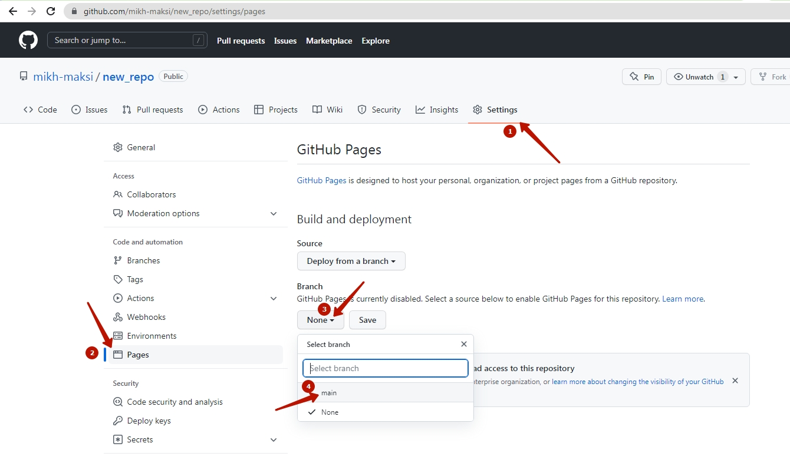

# GitHub-start
В данном занятті ми створимо власний репозитарій на сайті GitHub, та зможемо використати його як хостинг для Інтернет-сторінок.  
## Створення акаунту на сервісі GitHub
  
  
  
  
  
  
  
  
  
  
  

## В створеному акаунту створіть репозитарій
  
  
  

## Cтворіть файл index.html
  
  
  
  

## Запустить роботу сервісу Pages
  
  
  

## Змінимо створений файл index.html
  
  

## Вставимо готовий код, який створює картку ігор
  
  
  
  
  
  
  
